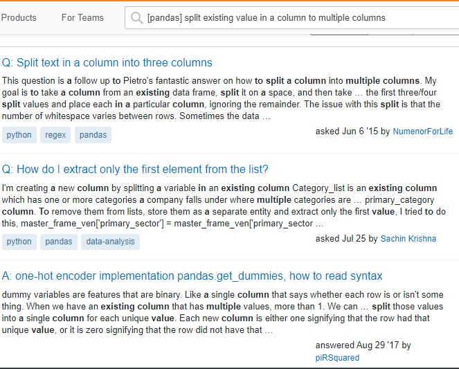
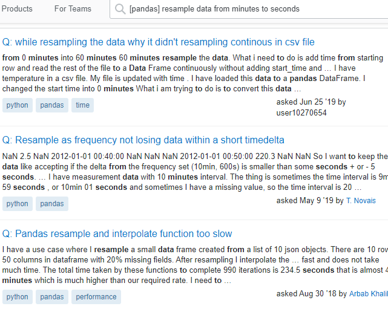

# Bert-based NLP Semantic Search System with StackOverflow Data

<p align="center">

[](https://jina.ai)
[](#license)
</a>
[](#)


## Overview
</p>

When I am have code related Errors, I rely on google search instead of Stackoverflow search. Thats because Most of the times, Stackoverflow search fails for lengthy queries (>= 5 words) & will not return any useful results. I guess, this is because lack of semantic capabilities for its search like google. As stackoverflow data is openly is available through Google BigQuery, I experimented with JINA neural search framework to use DISTIL BERT on stackoverflow data.

This repo was referenced from [jina examples](https://github.com/jina-ai/examples)

Check out details about the docker image [here](README.restful.md).

## Results
### Highlighting the improvements with semantic search

<table>
<tr>
<td>



</td>
<td>


Here, the only 1st results from stackoverflow search is relevant, but there are more smiliar results to the query asked which are retrieved by semantic search.


</td>
</tr>

<tr>
<td>


</td>
<td>


Here, the results are diverse (both from merge & join)
With help of semantics, it identified merge & join are similar.

</td>
</tr>

<tr>
<td>



</td>
<td>


Here, the results from stackoverflow search are not all relevant, while semantic search results are more relevant.

</td>
</tr>

</table>

## Prerequirements

This demo requires Python 3.7 or 3.8.

```bash
pip install --upgrade -r requirements.txt
```

## Define the Flows
### Index
To index the data we first need to define our **Flow** with a **YAML** file.
In the Flow YAML file, we add **Pods** in sequence.
In this demo, we have 5 pods defined with the names `extractor`, `encoder`, `chunk_indexer`, `doc_indexer`, and `join_all`.

However, we have another Pod working in silence.
In fact, the input to the very first Pod is always the Pod with the name **gateway**, the "Forgotten" Pod.
For most of the time, we can safely ignore the **gateway** because it basically does the dirty orchestration work for the Flow.

<table style="margin-left:auto;margin-right:auto;">
<tr>
<td> flow-index.yml</td>
</tr>
<tr>
<td>
  <sub>

```yaml
!Flow
pods:
  extractor:
    uses: pods/extract.yml
  encoder:
    uses: pods/encode.yml
    timeout_ready: 1200000
    read_only: true
  chunk_indexer:
    uses: pods/index-chunk.yml
  doc_indexer:
    uses: pods/index-doc.yml
    needs: extractor
  join_all:
    uses: _merge
    needs: [doc_indexer, chunk_indexer]
    read_only: true

```

</sub>

</td>
</tr>
</table>

By default, the input of each Pod is the Pod defined right above it, and the request message flows from one Pod to another. That's how Flow lives up to its name. Of course, you might want to have a Pod skipping over the Pods above it. In this case, you would use the `needs` argument to specify the source of the input messages. In our example, the `doc_indexer` actually get inputs directly from the `gateway`. By doing this, we have two parallel pathways as shown in the index Flow diagram.

```yaml
doc_indexer:
  uses: pods/index-doc.yml
  needs: gateway
```

As we can see, for most Pods, we only need to define the YAML file path. Given the YAML files, Jina will automatically build the Pods. Plus, `timeout_ready` is a useful argument when adding a Pod, which defines the waiting time before the Flow gives up on the Pod initializing.

```yaml
encoder:
  uses: pods/encode.yml
  timeout_ready: 60000
```

You might also notice the `join_all` Pod has a special YAML path. It denotes a built-in YAML path, which will merge all the incoming messages defined in `needs`.

```yaml
join_all:
  uses: _merge
  needs: [doc_indexer, chunk_indexer]
```

Overall, the index Flow has two pathways, as shown in the Flow diagram. The idea is to save the index and the contents seperately so that we can quickly retrieve the Document IDs from the index and afterwards combine the Document ID with its content.

The pathway on the right side with a single `doc_indexer` stores the Document content. Under the hood it is basically a key-value storage. The key is the Document ID and the value is the Document itself.

The pathway on the other side is for saving the index.
From top to bottom, the first Pod, `extractor`, splits the documents into the sentence (as text) and the character name (as meta info).
Both is stored with the document.
Anyhow, only the text is later encoded into vectors by the `encoder`.
These vectors are saved in a vector storage by `chunk_indexer`.
Finally, the two pathways are merged by `join_all` and the processing of that message is concluded.

### Run Index Flow


```bash
python app.py -t index -n 500
```


### Query
As in the indexing time, we also need a Flow to process the request message during querying.
Here we directly start with the `encoder` with a shorter `timeout_ready` interval, since the model is already prefetched during indexing.
Otherwise, it plays the same role as before, which is encoding the text into vectors.
Later these vectors are used to retrieve the indexed texts by `chunk_indexer`.

<table  style="margin-left:auto;margin-right:auto;">
<tr>
<td> flow-query.yml</td>
</tr>
<tr>
<td>
  <sub>

```yaml
!Flow
with:
  read_only: true
  port_expose: $JINA_PORT
pods:
  encoder:
    uses: pods/encode.yml
    timeout_ready: 60000
    read_only: true
  chunk_indexer:
    uses: pods/index-chunk.yml
    polling: all
    uses_reducing: _merge_all
  doc_indexer:
    uses: pods/index-doc.yml

```

</sub>

</td>
</tr>
</table>


In the last step, the `doc_indexer` comes into play. Sharing the same YAML file, `doc_indexer` will load the stored key-value index and retrieve the matched Documents according to the Document ID.

### Let's take a closer look
Obviously, they have different structures, although they share most Pods.
This is a common practice in the Jina world for the sake of speed.
Except for the `extractor`, both Flows can indeed use identical structures.
The two-pathway design of the index Flow is intended to speed up message passing, because indexing Chunks and Documents can be done in parallel.

Another important difference is that the two Flows are used to process different types of request messages. To index a Document, we send an **IndexRequest** to the Flow. While querying, we send a **SearchRequest**. That's why Pods in both Flows can play different roles while sharing the same YAML files. Later, we will dive deep into into the YAML files, where we define the different ways of processing messages of various types.


### Run Query Flow

```bash
python app.py -t query
```

<details>
<summary>Click here to see the console output</summary>

<p align="center">
  
</p>

</details>

For querying, we follow the same process to define and build the Flow from the YAML file. The `search_lines()` function is used to send a `SearchRequest` to the Flow. Here we accept the user's query input from the terminal and wrap it into a list of `string`.

```python
def query(top_k):
    f = Flow().load_config("flow-query.yml")
    with f:
        while True:
            text = input("please type a sentence: ")
            if not text:
                break

            def ppr(x):
                print_topk(x, text)
            f.search_lines(lines=[text, ], output_fn=ppr, top_k=top_k)
```

The `callback` argument is used to post-process the returned message. In this demo, we define a simple `print_topk` function to show the results. The returned message `resp` in a Protobuf message. `resp.search.docs` contains all the Documents for searching, and in our case there is only one Document. For each query Document, the matched Documents, `.match_doc`, together with the matching score, `.score`, are stored under the `.topk_results` as a repeated variable.

```python
def print_topk(resp, sentence):
    for d in resp.search.docs:
        print(f"Ta-Dah🔮, here are what we found for: {sentence}")
        for idx, match in enumerate(d.matches):

            score = match.score.value
            if score < 0.0:
                continue
            character = match.meta_info.decode()
            dialog = match.text.strip()
            print(f'> {idx:>2d}({score:.2f}). {character.upper()} said, "{dialog}"')
```


## Documentation

<a href="https://docs.jina.ai/">

</a>

The best way to learn Jina in depth is to read our documentation. Documentation is built on every push, merge, and release event of the master branch. You can find more details about the following topics in our documentation.

- [Jina command line interface arguments explained](https://docs.jina.ai/chapters/cli/index.html)
- [Jina Python API interface](https://docs.jina.ai/api/jina.html)
- [Jina YAML syntax for executor, driver and flow](https://docs.jina.ai/chapters/yaml/yaml.html)
- [Jina Protobuf schema](https://docs.jina.ai/chapters/proto/index.html)
- [Environment variables used in Jina](https://docs.jina.ai/chapters/envs.html)
- ... [and more](https://docs.jina.ai/index.html)


## License
Copyright (c) 2020 Jina AI Limited. All rights reserved.
Jina is licensed under the Apache License, Version 2.0. See [LICENSE](https://github.com/jina-ai/jina/blob/master/LICENSE) for the full license text.
